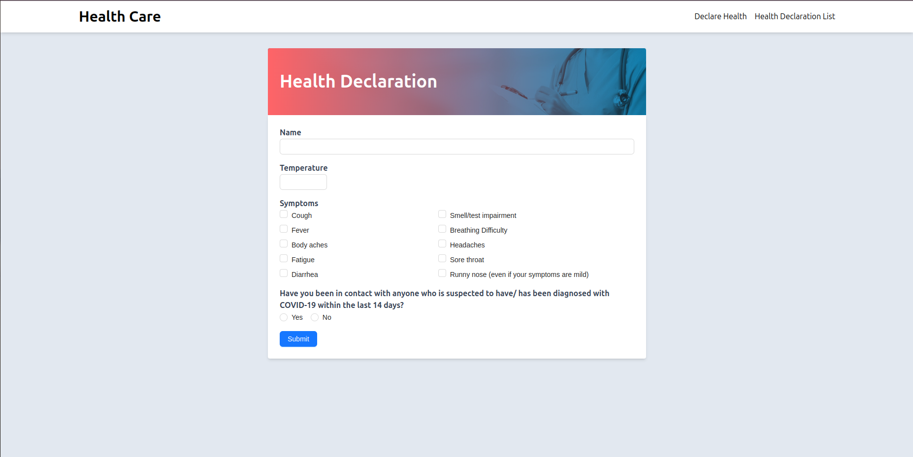
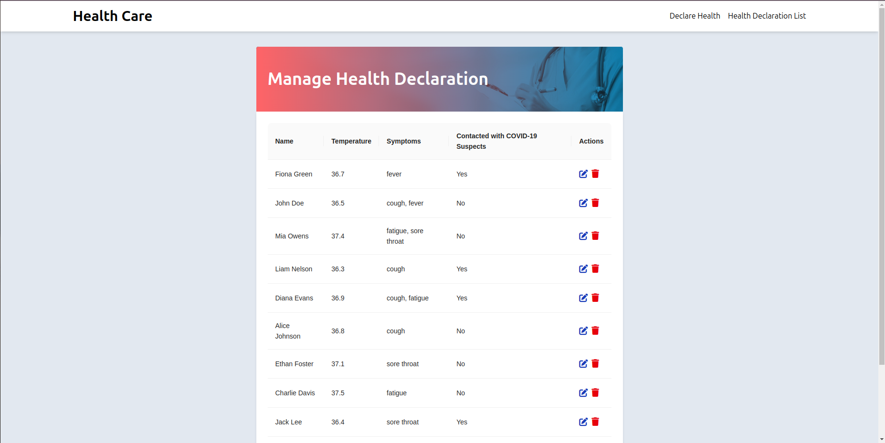
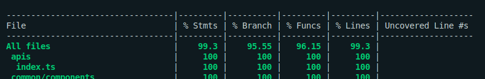
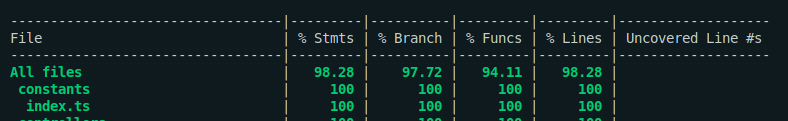

# Tech Assessment

### Installation

- Clone the repository:

```sh
git clone https://github.com/iMichael02/tech-assessment.git
cd tech-assessment
```

# Local Development

### Prerequisites

- Node.js (v14 or higher)
- npm (v6 or higher)
- Docker Engine (v17 or higher)

## Start Development

1. Run docker compose:

```sh
docker compose up --build
```

2. Open your browser and navigate to `http://localhost:5173/declare-health` or `http://localhost:5173/health-declaration-list` to see and interact with the UI.

3. You can use tools such as Postman to see the APIs in action with the following endpoints:

- Create new health declaration:

```sh
POST: http://0.0.0.0:3000/health-declaration
```

- Request body example:

```sh
{
  "name": "Dimmu Borgir",
  "temperature": 39,
  "symptoms": ["cough", "headaches"],
  "contactedWithCovid19Suspects": true
}
```

- Get health declaration list:

```sh
GET: http://0.0.0.0:3000/health-declaration
```

- UI screenshots:





## Build for Production

### Front-End

1. Navigate to frontend and build:

```sh
cd frontend && npm install && npm run build
```

2. The production-ready files will be in the `dist` directory. To start the built application, run:

```sh
npm run preview
```

### Backend

1. Navigate to backend and build:

```sh
cd backend && npm install && npm run build
```

2. The production-ready files will be in the `dist` directory. To start the built application, run:

```sh
npm run start
```

## Testing

1. Navigate to frontend or backend according to which you desire to test:

```sh
cd backend
or
cd frontend
```

2. Run install if you have not:

```sh
npm install
```

3. Run test:

```sh
npm run test
```

- Frontend test coverage:



- Backend test coverage:


